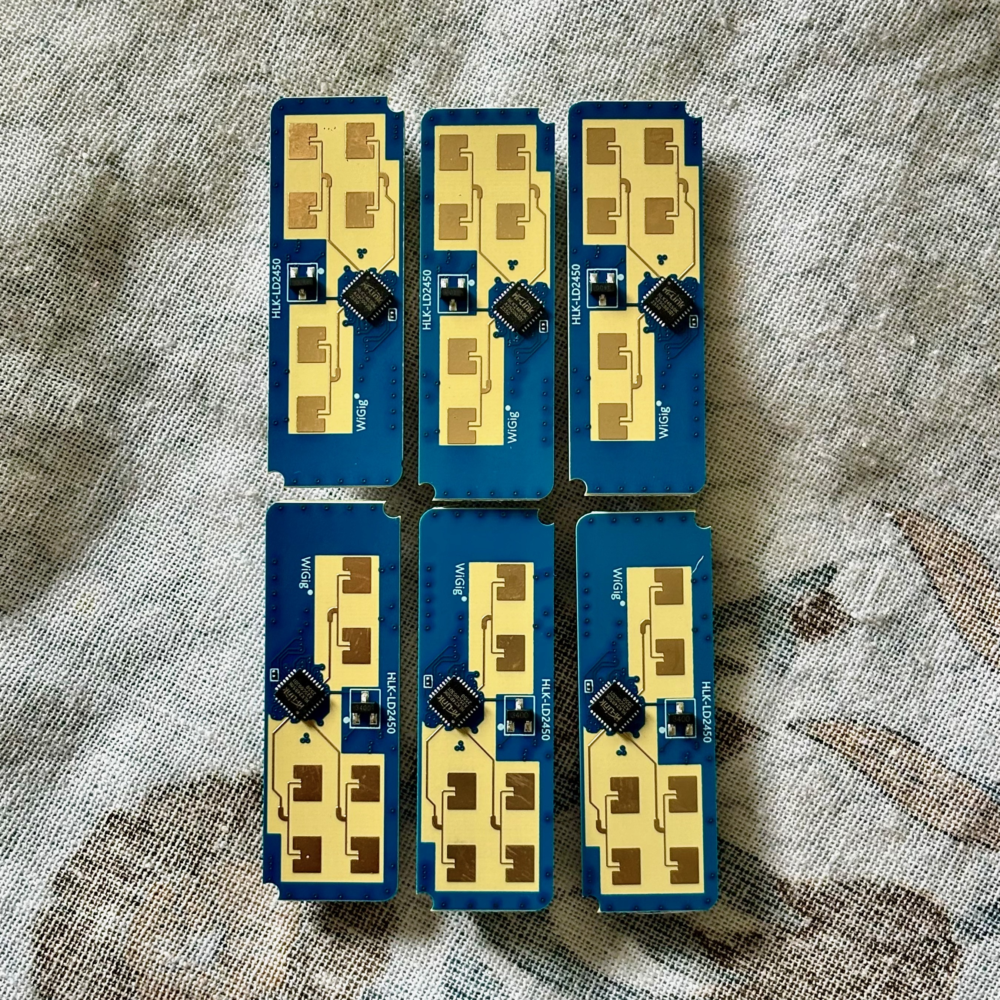
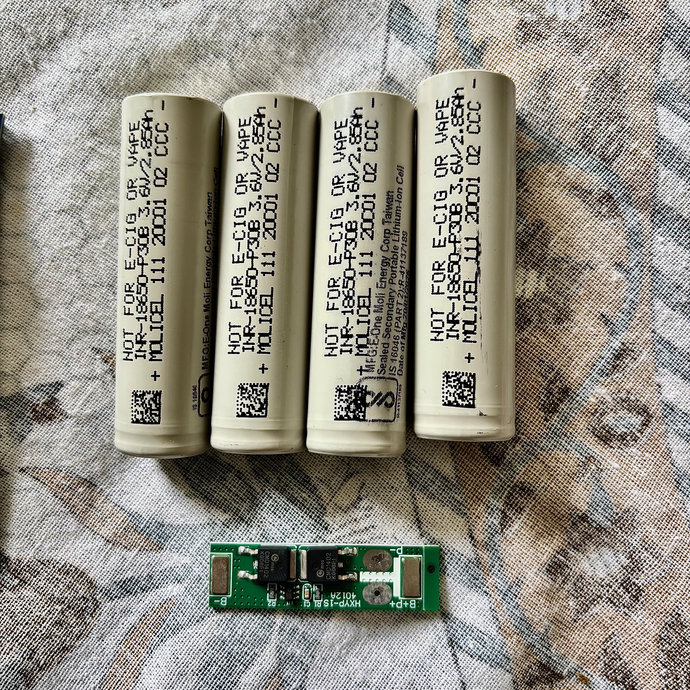
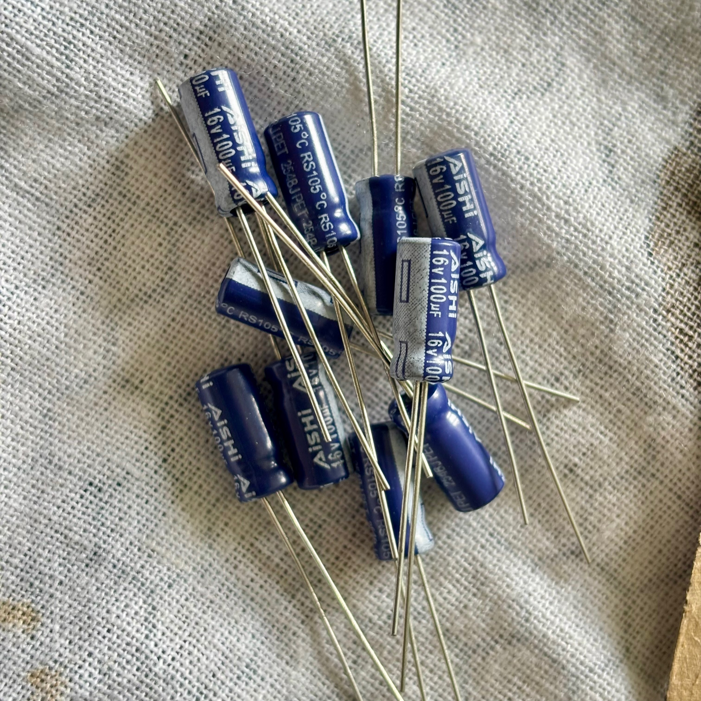
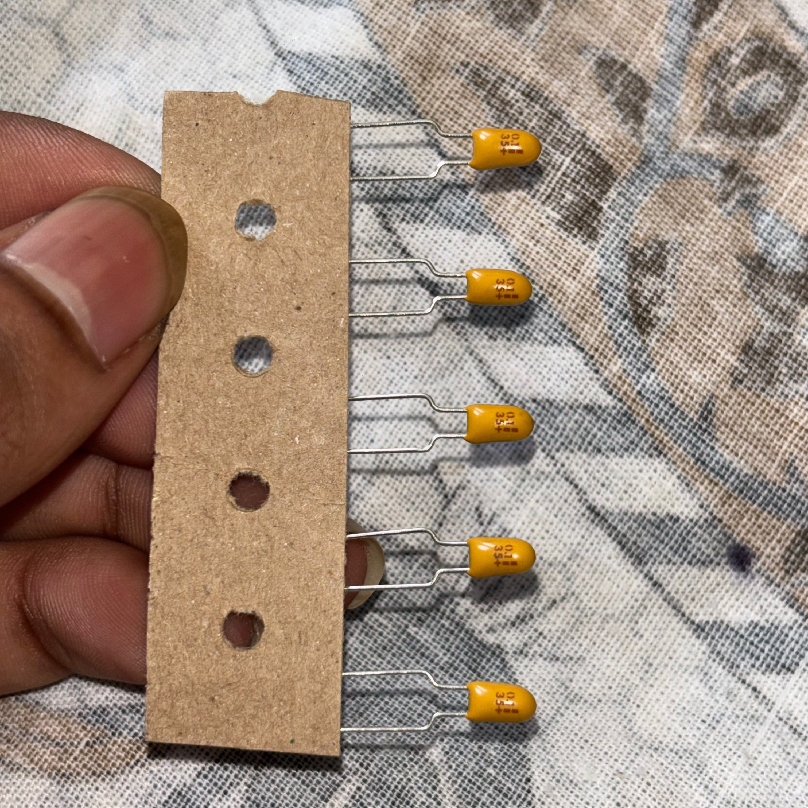
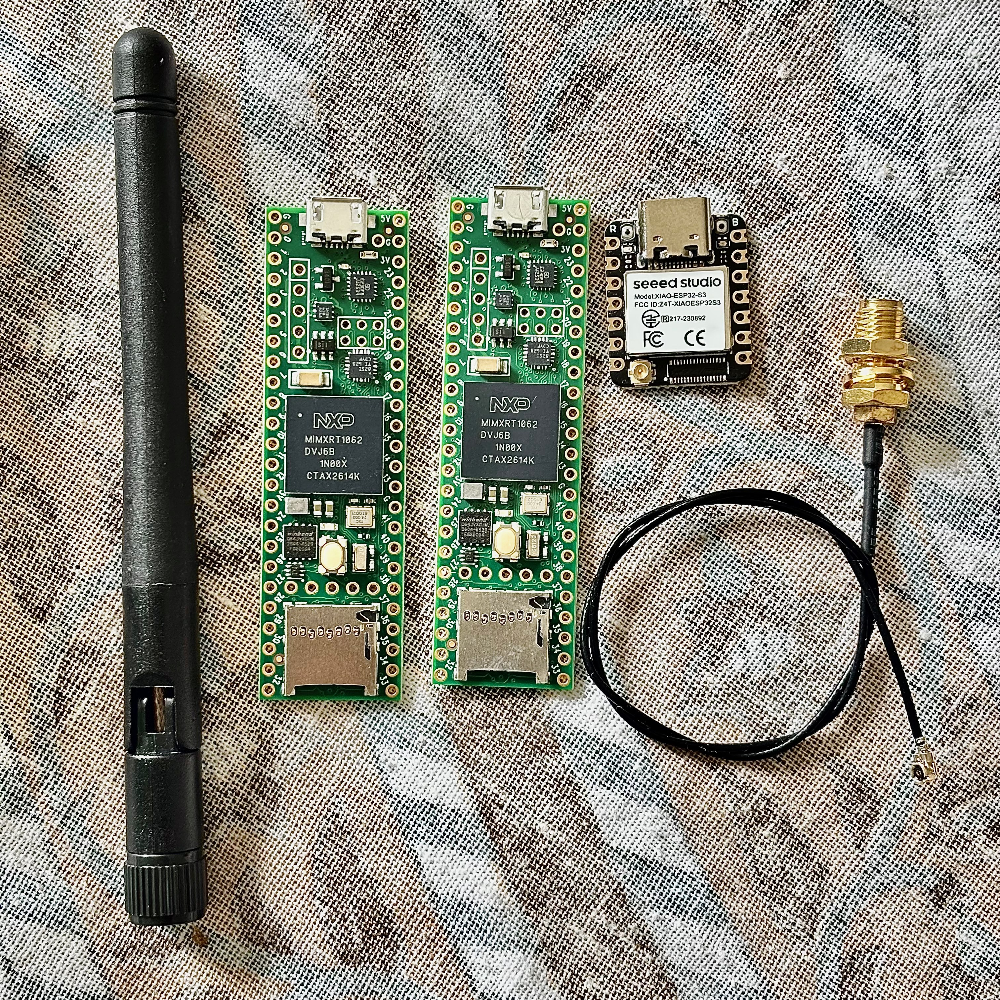
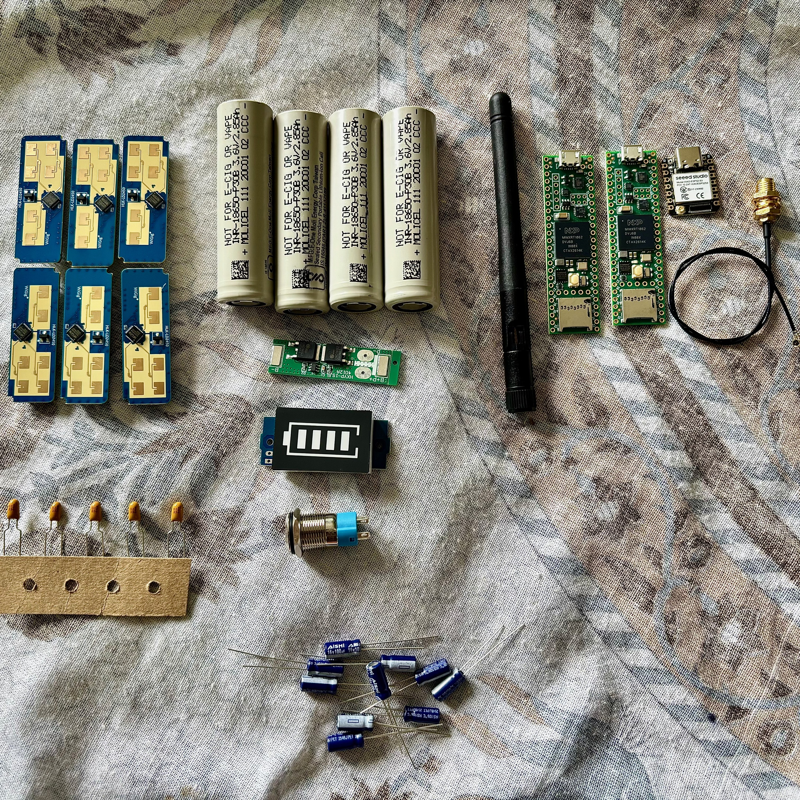

# PondEyes Omni-Lighthouse — Hardware Inventory

This directory contains photographs of the physical hardware received for the PondEyes Omni-Lighthouse prototype.

## Hardware Photo Inventory

### 01 — HLK-LD2450 Radar Modules

**File:**
`01_HLK_LD2450_Radar_Modules.jpeg`

**Description:**
Photograph showing six Hi-Link HLK-LD2450 24 GHz FMCW radar modules.

**Quantity visible:**
6

**Component:**
Hi-Link HLK-LD2450

**Role in PondEyes:**
Six radar modules are used as the distributed 360-degree sensing array, positioned around the cylindrical enclosure at 60-degree angular intervals.

**Important:**
The photograph documents the physical modules received. Do not claim electrical specifications that cannot be established from the photograph alone.

---

### 02 — 18650 Battery Cells and BMS

**File:**
`02_18650_Battery_Cells_and_BMS.jpeg`

**Description:**
Photograph showing four cylindrical 18650 lithium-ion cells and a small battery protection/BMS PCB.

**Visible components:**
- 4 × 18650 cylindrical Li-ion cells
- 1 × battery protection/BMS PCB

**Visible cell markings:**
- `NOT FOR E-CIG OR VAPE`
- `INR-18650-P30B 3.6V/2.85Ah`
- `+ MOLICEL 111 20C01 02 CCC -`
- `MFG: E-One Moli Energy Corp Taiwan`
- `Sealed Secondary Portable Lithium-ion Cell`
- `IS 16046 (PART 2)/IEC 62133-2`
- `Date of Mfg 20/01/2026`

**BMS PCB note:**
Visible silkscreen marking indicates `HXYP-1S-4012A` with solder pads `B-`, `B+`, `P+`, `P-`. Exact BMS model/rating requires verification from the PCB marking or datasheet.

---

### 03 — AiSHi Electrolytic Capacitors

**File:**
`03_AiSHi_100uF_16V_Electrolytic_Capacitors.jpeg`

**Description:**
Photograph showing blue radial electrolytic capacitors.

**Visible marking:**
- `AiSHi`
- `100µF`
- `16V`
- `105°C RS105°C`
- `2548J PET`

**Component:**
AiSHi 100 µF, 16 V electrolytic capacitor.

**Purpose in the PondEyes design:**
Power-rail bulk/decoupling capacitance associated with the sensor/electronics power system.

**Quantity visible:**
Multiple visible (loose radial leads). Visible quantity: not conclusively countable from photograph alone.

---

### 04 — 0.1µF 35V Tantalum Capacitors

**File:**
`04_0.1uF_35V_Tantalum_Capacitors.jpeg`

**Description:**
Photograph showing yellow axial/lead capacitors mounted on a temporary cardboard strip.

**Visible marking:**
- `0.1µF`
- `35V`

**Component:**
0.1 µF, 35 V capacitor.

**Package / Style:**
Yellow bead / dipped radial-lead capacitor mounted on a punched cardboard component carrier strip.

**Note:**
Documented exactly as visible. No specific manufacturer markings are established from the photograph alone. Electrical behavior is documented only to the marked 0.1 µF, 35 V rating.

---

### 05 — Teensy, XIAO ESP32-S3, Antenna and RF Hardware

**File:**
`05_Teensy41_XIAO_ESP32S3_Antenna_RF_Hardware.jpeg`

**Description:**
Photograph showing:
- 2 × Teensy 4.1 development boards (NXP MIMXRT1062 processor)
- 1 × Seeed Studio XIAO ESP32-S3 development board (Model: XIAO-ESP32-S3, FCC ID: Z4T-XIAOESP32S3)
- 1 × external antenna
- RF coaxial cable
- RF connector/bulkhead hardware

**Role in PondEyes:**
- The Teensy boards are the two primary radar-processing/controller boards in the PondEyes architecture.
- The XIAO ESP32-S3 is the network/broadcast controller.
- The antenna and coaxial hardware are intended for the wireless/RF interface.

Do not infer connector standards unless visible markings or dimensions establish them.

---

### 06 — Complete PondEyes Hardware Inventory

**File:**
`06_Complete_PondEyes_Hardware_Inventory.jpeg`

**Description:**
Overall photograph documenting the physical hardware received for the PondEyes Omni-Lighthouse prototype.

The photograph includes the major hardware groups:
- 6 × HLK-LD2450 radar modules
- 18650 battery cells
- Battery protection/BMS PCB
- Teensy 4.1 boards
- XIAO ESP32-S3
- External antenna
- RF cable/connector hardware
- Electrolytic capacitors
- Yellow capacitors
- Battery indicator/display module
- Panel-mount switch/button
- Additional visible prototype electronics/components

Only identify a component specifically when it is clearly visible or established by its marking.

---

## Component Summary Table

| Category | Component | Quantity Visible | Purpose |
|---|---|---:|---|
| Radar | Hi-Link HLK-LD2450 | 6 | 24 GHz radar sensing |
| Controller | Teensy 4.1 | 2 | Radar data processing/aggregation |
| Network Controller | Seeed Studio XIAO ESP32-S3 | 1 | Wireless/network broadcasting |
| Battery | 18650 Li-ion cells | 4 | Battery energy storage |
| Protection | Battery BMS/protection PCB | 1 visible | Battery protection |
| Bulk capacitor | AiSHi 100 µF 16 V electrolytic | Multiple visible | Power filtering/decoupling |
| Decoupling capacitor | 0.1 µF 35 V capacitors | Multiple visible | High-frequency decoupling |
| RF | External antenna | 1 | Wireless/RF interface |
| RF hardware | Coax/connector/bulkhead | 1 set visible | RF connection |
| User interface | Panel-mount switch/button | 1 visible | Power/control interface |
| Indicator | Battery indicator/display | 1 visible | Battery status indication |
